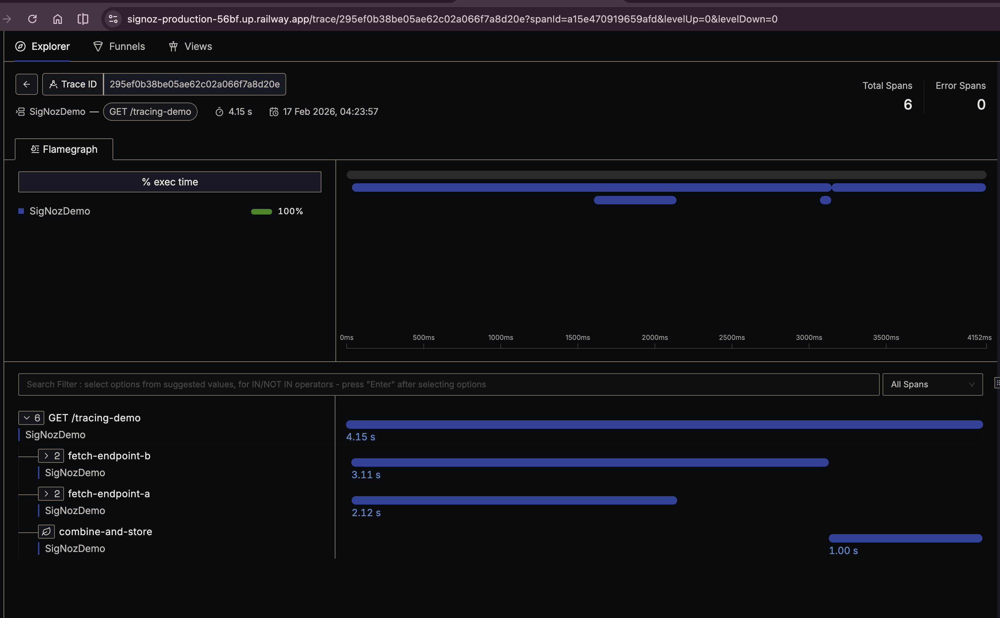

# Spring4Demo — SigNoz on Railway Quickstart

A Spring Boot 4.0 demo application that validates end-to-end observability (traces, metrics, logs) using [SigNoz](https://signoz.io/) deployed on [Railway](https://railway.com/).

Use this as a starting point to understand how OpenTelemetry instrumentation flows from your application into SigNoz, all running on Railway's infrastructure.

## What You Get

After completing this guide, you will have:

- A **SigNoz observability stack** (SigNoz UI, OpenTelemetry Collector, ClickHouse, ZooKeeper) running on Railway
- A **Spring Boot demo app** (this repo) deployed alongside it, sending traces and metrics to SigNoz
- A working `/tracing-demo` endpoint that produces a multi-span trace you can explore in SigNoz's flamegraph view

## Step 1 — Deploy the SigNoz Railway Template

Click the deploy button to provision the full SigNoz stack on Railway:

[](https://railway.com/deploy/sigonly)

**Template source**: [ZoeyJones/signoz-railway-template](https://github.com/ZoeyJones/signoz-railway-template) (a fork with pinned image versions and startup fixes)

This creates a Railway project with **7 services**:

| Service | Role |
|---------|------|
| **signoz** | Web UI — dashboards, trace explorer, alerts |
| **signoz-otel-collector** | Receives OTLP data (traces, metrics, logs) on port 4317 |
| **clickhouse** | Time-series storage backend |
| **zookeeper** | ClickHouse coordination |
| **signoz-sync-schema-migrator** | Runs DB migrations (sync) |
| **signoz-async-schema-migrator** | Runs DB migrations (async) |
| **SigNozDemo** | This Spring Boot app, pre-wired to send traces |

Wait until all services show **Online** in the Railway project dashboard:


Public networking is pre-configured in the template — **signoz** and **SigNozDemo** will each have a public domain assigned automatically. You can find them under each service's **Settings → Networking → Public Networking**.

### Handling Migration Timing

Railway does not support Docker-style `depends_on`, so services may start before migrations finish. If **signoz** or **signoz-otel-collector** crash-loop on first deploy, wait for the schema migrators to complete, then redeploy the failing services.

## Step 2 — Verify SigNoz Is Running

Open the **signoz** public domain in your browser. You should see the SigNoz welcome page confirming that **Logs, Traces, and Metrics ingestion is active**:


## Step 3 — Trigger a Trace

Hit the SigNozDemo endpoint to generate trace data:

```bash
curl https://<your-signoz-demo-domain>.up.railway.app/tracing-demo
```

This endpoint:
1. Creates a parent span `GET /tracing-demo`
2. Fires two parallel HTTP requests (`fetch-endpoint-a` at ~1.5s, `fetch-endpoint-b` at ~3s) as child spans
3. Combines results in a `combine-and-store` span (~1s)
4. Total trace duration: ~4-5 seconds

## Step 4 — View the Trace in SigNoz

1. Open your SigNoz dashboard
2. Navigate to **Traces → Explorer**
3. You should see the `SigNozDemo` service with the `GET /tracing-demo` trace
4. Click into it to see the flamegraph with all spans:



The flamegraph shows the parent span and its three child spans with their durations, giving you a clear picture of the request lifecycle.

## Taking It From Here

This template gives you a working SigNoz + OpenTelemetry setup on Railway. Here's how to build on it for your own services.

### Remove SigNozDemo After Validation

The **SigNozDemo** service exists solely to validate the SigNoz stack is working end-to-end. Once you've confirmed traces flow through (Steps 3-4 above), feel free to **delete the SigNozDemo service from your Railway project** and replace it with your own production service. The SigNoz stack (collector, ClickHouse, ZooKeeper, UI) runs independently and does not depend on SigNozDemo.

### Point Your Own App at the Collector

Your app does **not** need to be deployed via this template. Any service in the same Railway project can send OTLP data to the collector over Railway's private network:

```
OTEL_EXPORTER_OTLP_ENDPOINT=http://signoz-otel-collector.railway.internal:4317
```

For apps outside the Railway project, use the collector's public URL (you'll need to enable public networking on `signoz-otel-collector` as well).

### Key Environment Variables

| Variable | Purpose | Default in this app |
|----------|---------|---------------------|
| `OTEL_SERVICE_NAME` | Service name shown in SigNoz | `spring4demo-bare` |
| `OTEL_EXPORTER_OTLP_ENDPOINT` | Collector endpoint | `http://signoz-otel-collector.railway.internal:4317` |

### Instrumentation Approach

This app uses the [OpenTelemetry Java Agent](https://opentelemetry.io/docs/zero-code/java/agent/) for zero-code instrumentation (auto-instruments Spring MVC, HTTP clients, etc.) plus manual spans via the OpenTelemetry API for custom business logic. See `TracingDemo.kt` for examples.

### What to Explore in SigNoz

- **Traces** — Distributed traces, flamegraphs, service maps
- **Metrics** — This app publishes `app.deployments` (counter) and `app.memory.used` (gauge)
- **Logs** — SigNoz can ingest structured logs via OTLP
- **Dashboards** — Build custom dashboards from any ingested data
- **Alerts** — Set up threshold-based alerts on metrics or trace latency

## Project Structure

```
Spring4Demo/
├── app/
│   └── src/main/kotlin/.../
│       ├── MiniApplication.kt          # Spring Boot entry point
│       ├── TracingDemoController.kt    # GET /tracing-demo endpoint
│       ├── TracingDemo.kt              # Parallel HTTP calls with manual spans
│       ├── TracingDemoResult.kt        # Response DTO
│       ├── DeploymentCounter.kt        # Custom counter metric
│       └── MemoryGauge.kt             # Custom gauge metric
├── railway.toml                        # Railway deployment config
├── docs/                               # Deployment screenshots
└── .github/workflows/ci.yml           # CI pipeline
```

## Tech Stack

- Kotlin 2.2 / Spring Boot 4.0 / Java 21
- OpenTelemetry Java Agent 2.25
- SigNoz (via Railway template)
- Railway (deployment platform)
